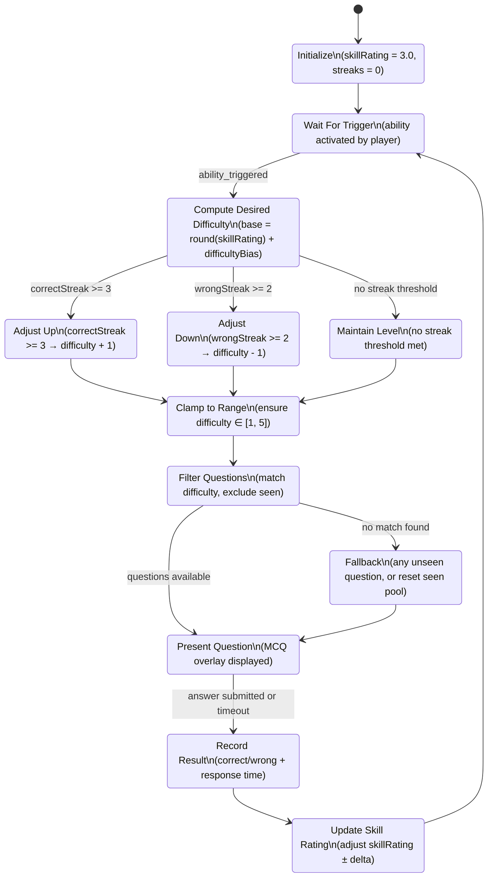
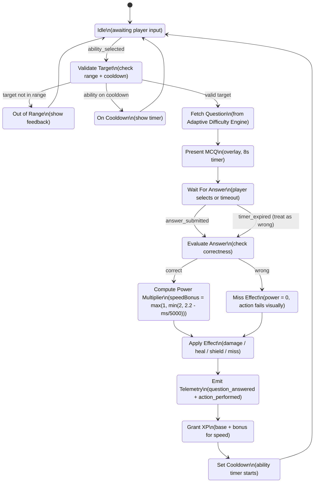
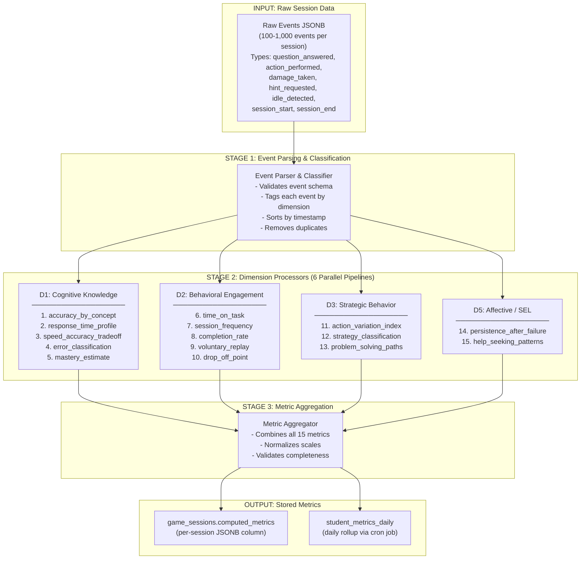
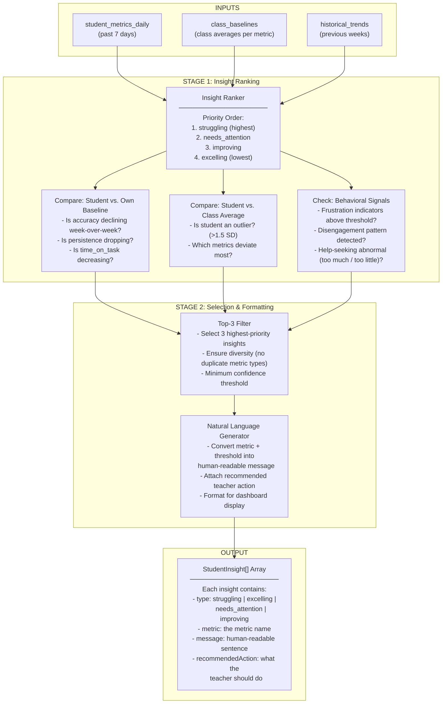

# TIE 204: MVP Studio — Lab 2
## System Architecture & Algorithm Mapping
**Project:** EdGame — Game-Based Educational Assessment Platform
**Team:** EdGame Team
**Date:** February 2026
**Course:** TIE 204: MVP Studio | Prof. Dr. Amr T. Abdel-Hamid

---

## Part 1: Problem Framing

### Problem Statement

Math and Science teachers in K-12 schools (grades 4-12) — particularly in GCC private schools and US charter schools — face a persistent diagnostic gap: traditional homework and assessments produce a single score that reveals *that* a student performed poorly, but never *why*. Was the low grade caused by a conceptual misunderstanding, guessing under time pressure, frustration leading to disengagement, or simple loss of focus? When a teacher assigns practice and receives back a gradebook column of numbers, they must plan instruction for 30+ students with vastly different needs, yet they have no behavioral or cognitive insight into the process behind each answer. This gap between "score" and "diagnosis" wastes limited class time — teachers reteach content some students already know while missing the specific misconceptions of those who are struggling. EdGame addresses this by replacing the traditional worksheet with a 15-minute game session powered by stealth assessment, grounded in Evidence-Centered Design (ECD), that captures 15 behavioral analytics metrics during gameplay and distills them into a teacher dashboard showing the top 3 actionable insights per student (e.g., "Sarah struggles with fractions — 42% accuracy, guessing under time pressure" or "Ahmed's persistence is declining — he quits after first wrong answer") — insights a teacher can act on in 30 seconds to make a real instructional difference the very next morning.

---

## Part 2: Solution Exploration via Algorithms

### 2a. Algorithm Intent Table

The following table defines the four core algorithms that power EdGame's stealth assessment pipeline. Each algorithm addresses a distinct stage of the data lifecycle: from keeping students engaged (Adaptive Difficulty), to invisibly assessing them (Combat Resolution), to transforming raw events into metrics (Behavioral Metric Computation), to surfacing actionable insights for teachers (Top-3 Insight Generation).

| # | Algorithm Name | Purpose | Inputs | Outputs | Trigger | Notes / Assumptions |
|---|---------------|---------|--------|---------|---------|---------------------|
| 1 | **Adaptive Difficulty** | Adjusts question difficulty to keep students in their Zone of Proximal Development — challenging enough to learn, not so hard they disengage. Based on the EdGame Analytics Blueprint's recommendation to maintain challenges at the "outer edges of do-ability" (flow theory + Vygotsky's ZPD). | Player's running `skillRating` (float 1-5), `correctStreak` count, `wrongStreak` count, accuracy ratio, `difficultyBias` from ability type | Target difficulty level (integer 1-5), selected question matching that difficulty | Each time a player triggers an ability (an answer is required before the action resolves) | Assumes ~10 questions per difficulty band per subject; falls back to random unseen question if exact difficulty match unavailable; `difficultyBias` from role actions (e.g., Power Strike adds +1 bias). Based on the actual implementation in `PulseRealms/src/systems/questionEngine.js`. |
| 2 | **Question-Gated Combat Resolution** | Gate every game action (attack, heal, shield) behind a subject-specific MCQ, tying gameplay power to academic accuracy and speed. This is the core stealth assessment mechanism — students are being assessed without realizing it because assessment IS the gameplay (ECD Evidence Model). | Actor object, target object, action ID, subject ID; question from question engine; player's answer (correct/incorrect + response time in ms) | Power multiplier (0 on wrong, 1.0-2.0 scaled by speed on correct), combat effect (damage/heal/shield/miss), XP granted, telemetry events emitted | When any actor (player or bot) activates an ability | Speed multiplier formula: `max(1, min(2, 2.2 - responseTimeMs/5000))`; bots simulate outcomes probabilistically. Based on `PulseRealms/src/systems/combatSystem.js`. |
| 3 | **Behavioral Metric Computation** | Transform raw gameplay events (`question_answered`, `action_performed`, `damage_taken`, `hint_requested`, `idle_detected`, etc.) into 15 meaningful teacher-facing metrics organized across the EdGame Analytics Blueprint's 6 dimensions: Cognitive Knowledge, Behavioral Engagement, Strategic Behavior, Social/Collaborative, Affective/SEL, and Temporal/Longitudinal. | Array of raw `GameEvent` objects from a completed session (each with `type`, `timestamp`, `payload`). Typically 100-1,000 events per session. | A `computed_metrics` JSONB object containing 15 metric values (`accuracy_by_concept`, `speed_accuracy_tradeoff`, `error_pattern`, `persistence`, `help_seeking`, `time_on_task`, `session_frequency`, `completion_rate`, etc.) | On session end (`POST /api/sessions/[id]/end`), then daily rollup cron job for aggregation | Phase 1 computes server-side via PostgreSQL functions. Some metrics (`improvement_trajectory`, `mastery_threshold`) require multiple sessions. `collaboration_style` is Phase 2 (multiplayer). |
| 4 | **Top-3 Insight Generation** | Distill 15 raw metrics into the 3 most actionable insights per student per week, so teachers can act immediately without data overload. Directly implements the EdGame Analytics Blueprint's "What Do I Do Monday Morning?" principle — every dashboard element must translate into instructional action. | Student's `computed_metrics` for the past 7 days, class-level baselines (averages), historical trend data (previous weeks) | Array of 3 `StudentInsight` objects, each with: `type` (struggling / excelling / needs_attention / improving), metric name, human-readable message, recommended teacher action | On teacher dashboard load, or weekly scheduled job | Priority ranking: struggling > needs_attention > improving > excelling. Insights compare student to own historical baseline AND class average. Requires minimum 3 sessions for meaningful insights. |

---

### 2b. Algorithm Models

Below are the formal models for each algorithm. Algorithms 1 and 2 are modeled as **Finite State Machines (FSMs)** because they are event-driven, sequential, and state-dependent. Algorithms 3 and 4 are modeled as **Dataflow Diagrams** because they are transformation pipelines that process data through stages without maintaining internal state between invocations.

---

#### Algorithm 1: Adaptive Difficulty — Finite State Machine

This FSM governs how the game selects the next question's difficulty level. It keeps the student in the flow channel by dynamically adjusting challenge based on recent performance.



**State Descriptions:**

| State | Description |
|-------|-------------|
| Initialize | Sets default `skillRating` to 3.0 (middle of 1-5 range), zeroes all streak counters. Runs once at session start. |
| WaitForTrigger | Idle state. Listens for the player to activate any ability (attack, heal, shield). |
| ComputeDifficulty | Calculates base difficulty as `round(skillRating) + difficultyBias` where `difficultyBias` comes from the ability type (e.g., Power Strike adds +1). |
| AdjustUp | If 3+ correct answers in a row, increase difficulty by 1 to maintain challenge. |
| AdjustDown | If 2+ wrong answers in a row, decrease difficulty by 1 to prevent frustration. |
| MaintainLevel | Neither streak threshold met — keep current difficulty. |
| ClampRange | Clamps final difficulty to [1, 5] to prevent out-of-bounds values. |
| FilterQuestions | Queries question pool for unseen questions at the target difficulty for the current subject. |
| FallbackIfEmpty | If no matching questions exist, selects any unseen question or resets the seen pool. |
| PresentQuestion | Displays the MCQ overlay on the game screen. Timer starts (8 seconds). |
| RecordResult | Captures whether the answer was correct/wrong and the response time in milliseconds. Updates streak counters. |
| UpdateSkillRating | Adjusts `skillRating` based on correctness: +delta for correct (scaled by difficulty), -delta for wrong. Returns to waiting state. |

---

#### Algorithm 2: Question-Gated Combat Resolution — Finite State Machine

This FSM models the complete lifecycle of a single combat action. Every game action is gated behind a question — there is no way to attack, heal, or shield without answering. This is stealth assessment in action.



**State Descriptions:**

| State | Description |
|-------|-------------|
| Idle | Game is running, no action in progress. Player can move, observe, or select an ability. |
| ValidateTarget | Checks whether the selected target is within ability range and the ability is not on cooldown. |
| OutOfRange / OnCooldown | Invalid action — provide visual feedback and return to idle without consuming a question. |
| FetchQuestion | Requests a question from the Adaptive Difficulty Engine at the computed difficulty level for the current subject. |
| PresentMCQ | Displays the multiple-choice question as a game overlay. An 8-second countdown timer begins. Game state pauses. |
| WaitForAnswer | Waits for the player to select an answer option or for the timer to expire. Timer expiry is treated as a wrong answer. |
| EvaluateAnswer | Determines correctness by comparing selected option to the stored correct answer. |
| ComputePowerMultiplier | For correct answers: calculates speed bonus using `max(1, min(2, 2.2 - responseTimeMs / 5000))`. Fast correct answers deal more damage / provide stronger heals. |
| MissEffect | For wrong answers: sets power multiplier to 0. The ability visually "misses" or "fizzles." |
| ApplyEffect | Applies the computed effect to the target: damage, healing, shield points, or miss animation. |
| EmitTelemetry | Queues two telemetry events: `question_answered` (with question ID, correctness, response time, difficulty) and `action_performed` (with action type, power, target, outcome). Events are buffered and batch-sent every 10 seconds. |
| GrantXP | Awards experience points: base XP for answering + bonus XP scaled by speed multiplier and difficulty level. |
| SetCooldown | Starts the ability cooldown timer. Returns to idle. |

---

#### Algorithm 3: Behavioral Metric Computation — Dataflow Diagram

This is a data transformation pipeline, not a stateful process, so it is modeled as a dataflow diagram. Raw gameplay events flow through dimension-specific processors and are aggregated into structured metrics.



**Dimension Details:**

| Dimension | Metrics Computed | Key SQL Operations |
|-----------|-----------------|-------------------|
| D1: Cognitive Knowledge | `accuracy_by_concept`, `response_time_profile`, `speed_accuracy_tradeoff`, `error_classification`, `mastery_estimate` | AVG(correctness) GROUP BY concept_tag, REGR_SLOPE(accuracy, session_number) for mastery trajectory |
| D2: Behavioral Engagement | `time_on_task`, `session_frequency`, `completion_rate`, `voluntary_replay`, `drop_off_point` | SUM(active_time), COUNT(DISTINCT session_date), percentage of questions attempted vs. available |
| D3: Strategic Behavior | `action_variation_index`, `strategy_classification`, `problem_solving_paths` | COUNT(DISTINCT action_types) / total_actions, sequence pattern analysis |
| D5: Affective / SEL | `persistence_after_failure`, `help_seeking_patterns` | Ratio of continued play after wrong answers, frequency and timing of hint requests |

> **Note:** D4 (Social/Collaborative) and D6 (Temporal/Longitudinal) are Phase 2 features requiring multiplayer and multi-week data respectively. They are architecturally planned but not computed in Phase 1.

---

#### Algorithm 4: Top-3 Insight Generation — Dataflow Diagram

This pipeline transforms raw metrics into human-readable, actionable insights. It is the final step in EdGame's data lifecycle — the bridge between analytics and teacher action.



**Insight Type Examples:**

| Type | Example Message | Recommended Action |
|------|----------------|-------------------|
| **struggling** | "Sarah struggles with fractions — 42% accuracy, guessing under time pressure (avg response time 1.2s vs. class avg 4.1s)" | "Consider 1-on-1 check-in on fraction concepts. She may benefit from manipulatives or visual fraction models." |
| **needs_attention** | "Ahmed's persistence is declining — he quits after first wrong answer (persistence_after_failure dropped from 0.8 to 0.3 this week)" | "Encourage growth mindset. Consider pairing Ahmed with a peer mentor or reducing initial difficulty to rebuild confidence." |
| **improving** | "Fatima's mastery of geometry improved significantly — accuracy up from 55% to 78% over 3 sessions" | "Acknowledge progress publicly. Consider advancing Fatima to more challenging geometry content." |
| **excelling** | "Omar consistently exceeds class average across all metrics (top 10% in accuracy, speed, and persistence)" | "Offer enrichment activities or peer tutoring role. Omar may be ready for above-grade-level content." |

---

> **Why This Matters for Teachers:** Traditional assessment captures only correctness — a single number. EdGame's architecture is designed from the ground up to capture the behavioral signals that explain *why* students succeed or fail. Every algorithm in this system exists to answer one question: "What should I do differently in class on Monday morning?" The adaptive difficulty keeps students engaged (no frustration, no boredom). The combat resolution makes assessment invisible (stealth assessment). The metric computation transforms raw clicks into diagnostic insights. And the insight generator translates data into plain-English recommendations a teacher can act on in 30 seconds.

---

## Part 3: System Architecture Design

### 3a. Architecture Diagram

The following diagram illustrates EdGame's complete system architecture, showing all layers from end users to data storage, and the communication protocols between them.

```
┌─────────────────────────────────────────────────────────────────────────────────┐
│                          EXTERNAL USERS & SYSTEMS                               │
│                                                                                 │
│  ┌──────────────┐     ┌──────────────┐     ┌──────────────────────┐            │
│  │   Student     │     │   Teacher    │     │   Google Classroom   │            │
│  │   (Browser)   │     │   (Browser)  │     │   (LTI 1.3)         │            │
│  │              │     │              │     │                      │            │
│  │  Plays the   │     │  Views the   │     │  Roster sync,        │            │
│  │  game,       │     │  dashboard,  │     │  assignment import,  │            │
│  │  answers     │     │  assigns     │     │  grade passback      │            │
│  │  questions   │     │  games       │     │                      │            │
│  └──────┬───────┘     └──────┬───────┘     └──────────┬───────────┘            │
│         │                    │                        │                         │
└─────────┼────────────────────┼────────────────────────┼─────────────────────────┘
          │                    │                        │
          │         HTTPS (TLS 1.3)                     │
          │                    │                        │
┌─────────┼────────────────────┼────────────────────────┼─────────────────────────┐
│         │       CLIENT SOFTWARE (Browser)             │                         │
│         │                    │                        │                         │
│  ┌──────▼────────────────────▼────────────────────────▼─────┐                   │
│  │                 GAME CLIENT (KAPLAY.js)                   │                   │
│  │                                                           │                   │
│  │  ┌───────────────────┐   ┌────────────────────────────┐  │                   │
│  │  │   Scene Manager   │   │   Event Collector           │  │                   │
│  │  │                   │   │   - Buffers telemetry events │  │                   │
│  │  │   - Title screen  │   │   - Batch POST every 10s    │  │                   │
│  │  │   - Character     │   │   - Offline queue with      │  │                   │
│  │  │     select        │   │     retry logic             │  │                   │
│  │  │   - Arena combat  │   │                              │  │                   │
│  │  │   - Results       │   └────────────────────────────┘  │                   │
│  │  └───────────────────┘                                    │                   │
│  │                                                           │                   │
│  │  ┌───────────────────┐   ┌────────────────────────────┐  │                   │
│  │  │ ★ ADAPTIVE        │   │   Question Engine           │  │                   │
│  │  │   DIFFICULTY      │   │   - Provider pattern:       │  │                   │
│  │  │   ENGINE          │   │     JSON file → API         │  │                   │
│  │  │                   │   │   - Filters by difficulty    │  │                   │
│  │  │  (Algorithm 1)    │   │     + subject + seen status │  │                   │
│  │  └───────────────────┘   └────────────────────────────┘  │                   │
│  │                                                           │                   │
│  │  ┌───────────────────┐   ┌────────────────────────────┐  │                   │
│  │  │ ★ COMBAT SYSTEM   │   │   Progression System        │  │                   │
│  │  │   (Question-Gated │   │   - XP accumulation         │  │                   │
│  │  │    Resolution)    │   │   - Level progression       │  │                   │
│  │  │                   │   │   - Badge unlocks           │  │                   │
│  │  │  (Algorithm 2)    │   │   - Streak rewards          │  │                   │
│  │  └───────────────────┘   └────────────────────────────┘  │                   │
│  └───────────────────────────────────────────────────────────┘                   │
│                                                                                  │
│  ┌───────────────────────────────────────────────────────────┐                   │
│  │              TEACHER DASHBOARD (Next.js + React)          │                   │
│  │                                                           │                   │
│  │  ┌─────────────────┐  ┌─────────────────┐                │                   │
│  │  │ Class Overview   │  │ Student         │                │                   │
│  │  │ - Roster list    │  │ Drill-down      │                │                   │
│  │  │ - Avg metrics    │  │ - Per-student   │                │                   │
│  │  │ - Assignment     │  │   metrics       │                │                   │
│  │  │   status         │  │ - Session       │                │                   │
│  │  │                  │  │   history       │                │                   │
│  │  └─────────────────┘  └─────────────────┘                │                   │
│  │                                                           │                   │
│  │  ┌─────────────────┐  ┌─────────────────┐                │                   │
│  │  │ ★ TOP-3 INSIGHTS│  │ Concept Mastery │                │                   │
│  │  │   PANEL          │  │ Heatmap         │                │                   │
│  │  │                  │  │ - Subject ×     │                │                   │
│  │  │  Displays output │  │   concept grid  │                │                   │
│  │  │  of Algorithm 4  │  │ - Color-coded   │                │                   │
│  │  │                  │  │   by mastery %  │                │                   │
│  │  └─────────────────┘  └─────────────────┘                │                   │
│  └───────────────────────────────────────────────────────────┘                   │
│                                                                                  │
└──────────────────────────────────┬───────────────────────────────────────────────┘
                                   │
                                   │ HTTPS (REST API + Realtime WebSocket)
                                   │
┌──────────────────────────────────▼───────────────────────────────────────────────┐
│                   CLOUD APPLICATION (Vercel Edge Network)                        │
│                                                                                  │
│  ┌────────────────────────┐  ┌──────────────────────┐  ┌─────────────────────┐  │
│  │  Next.js API Routes    │  │  Edge Functions       │  │  LTI 1.3 Bridge    │  │
│  │                        │  │                       │  │                     │  │
│  │  POST /api/sessions    │  │  Auth middleware       │  │  OIDC login flow   │  │
│  │    - start / end       │  │  (JWT validation)     │  │  Deep linking       │  │
│  │  POST /api/events      │  │                       │  │  (assignment →      │  │
│  │    - batch telemetry   │  │  Rate limiting         │  │   game session)    │  │
│  │  GET  /api/analytics   │  │  (per-user, per-IP)   │  │  Grade passback     │  │
│  │    - metrics + insights│  │                       │  │  (scores → LMS)    │  │
│  │  CRUD /api/assignments │  │  CORS handling         │  │                     │  │
│  │  CRUD /api/environments│  │  (allowed origins)    │  │                     │  │
│  │  GET  /api/questions   │  │                       │  │                     │  │
│  └────────────────────────┘  └──────────────────────┘  └─────────────────────┘  │
│                                                                                  │
│  ┌────────────────────────────────────────────────────────────────────────────┐  │
│  │  ★ INSIGHT GENERATION (Algorithm 4) — Vercel Edge Function                │  │
│  │    - Triggered on dashboard load OR weekly cron                            │  │
│  │    - Queries PostgreSQL for student metrics + class baselines             │  │
│  │    - Ranks and selects top-3 insights                                     │  │
│  │    - Returns StudentInsight[] to dashboard                                │  │
│  │    - Results cached for 24 hours (ISR / stale-while-revalidate)           │  │
│  └────────────────────────────────────────────────────────────────────────────┘  │
│                                                                                  │
└──────────────────────────────────┬───────────────────────────────────────────────┘
                                   │
                                   │ PostgreSQL Wire Protocol (connection pooling)
                                   │
┌──────────────────────────────────▼───────────────────────────────────────────────┐
│                        BACKEND SERVICES (Supabase)                               │
│                                                                                  │
│  ┌───────────────────────┐  ┌──────────────────┐  ┌─────────────────────────┐   │
│  │     PostgreSQL        │  │     Auth          │  │     Realtime            │   │
│  │                       │  │                   │  │                         │   │
│  │  Tables:              │  │  JWT token issue  │  │  WebSocket channels     │   │
│  │  - users              │  │  Google OAuth 2.0 │  │  for live dashboard     │   │
│  │  - schools            │  │  Magic link email │  │  updates (teacher       │   │
│  │  - classes            │  │  RLS policies     │  │  sees student progress  │   │
│  │  - game_sessions      │  │  (row-level       │  │  in near-real-time)    │   │
│  │  - session_events     │  │   security)       │  │                         │   │
│  │  - questions          │  │                   │  │                         │   │
│  │  - assignments        │  └──────────────────┘  └─────────────────────────┘   │
│  │  - student_metrics    │                                                       │
│  │    _daily             │  ┌──────────────────────────────────────────────┐     │
│  │                       │  │     Storage (S3-compatible)                  │     │
│  │  Views:               │  │                                              │     │
│  │  - class_baselines    │  │  Game assets (sprite sheets, tilesets)      │     │
│  │  - student_trends     │  │  Audio files (BGM, SFX)                    │     │
│  │                       │  │  Question images (diagrams, graphs)         │     │
│  │  ┌─────────────────┐  │  │                                              │     │
│  │  │ ★ ANALYTICS     │  │  └──────────────────────────────────────────────┘     │
│  │  │   ENGINE         │  │                                                      │
│  │  │                  │  │                                                      │
│  │  │  ★ Algorithm 3:  │  │                                                      │
│  │  │  Behavioral      │  │                                                      │
│  │  │  Metric          │  │                                                      │
│  │  │  Computation     │  │                                                      │
│  │  │                  │  │                                                      │
│  │  │  - PostgreSQL    │  │                                                      │
│  │  │    functions     │  │                                                      │
│  │  │  - Triggered on  │  │                                                      │
│  │  │    session end   │  │                                                      │
│  │  │  - Daily rollup  │  │                                                      │
│  │  │    via cron job  │  │                                                      │
│  │  └─────────────────┘  │                                                      │
│  └───────────────────────┘                                                       │
│                                                                                  │
└──────────────────────────────────────────────────────────────────────────────────┘

Legend:
  ★  = Algorithm execution location (see Algorithm Mapping Table below)
  →  = Data flow direction
  │  = Layer boundary
```

**Data Flow Summary:**

1. **Student plays game** → Game Client (KAPLAY.js) runs Algorithms 1 and 2 locally → telemetry events are buffered
2. **Events batched** → Event Collector POSTs to `/api/events` every 10 seconds → stored in `session_events` table
3. **Session ends** → `POST /api/sessions/[id]/end` triggers Algorithm 3 → `computed_metrics` written to `game_sessions`
4. **Daily cron** → Aggregates session metrics into `student_metrics_daily` table
5. **Teacher opens dashboard** → Algorithm 4 runs → queries metrics + baselines → returns Top-3 Insights
6. **Realtime updates** → Supabase Realtime pushes live session progress to teacher dashboard via WebSocket

---

### 3b. Algorithm Mapping Table

The following table maps each algorithm to its execution location within the architecture and provides justification for the placement decision.

| Algorithm | System Layer | Execution Location | Justification |
|-----------|-------------|-------------------|---------------|
| **1. Adaptive Difficulty** | Application Logic (Game Client) | Student's browser (client-side, KAPLAY.js) | Must be immediate (<100ms) to maintain game flow and avoid breaking immersion. Operates on per-session state only (`skillRating`, streaks) — no cross-student data needed. No round-trip to server required; latency-sensitive since it blocks ability usage. A server round-trip would introduce 200-500ms delay, breaking the flow state that is essential for stealth assessment. Aligns with the core stealth assessment principle: assessment must be invisible to maintain the student's flow state. |
| **2. Question-Gated Combat Resolution** | Game Logic (Game Client) | Student's browser (client-side, KAPLAY.js) | Core game loop that must be synchronous with gameplay rendering. The MCQ overlay blocks game state until answered or the 8-second timer expires. Bot outcomes are simulated locally using probability tables (no server needed). Telemetry events are queued and batch-sent asynchronously (non-blocking). Must execute in the same rendering frame as the game engine for immediate visual feedback (particles, beams, damage numbers). Client-side execution also enables offline-first gameplay — students in low-connectivity environments can still play. |
| **3. Behavioral Metric Computation** | Data Processing (Backend) | Supabase PostgreSQL (server-side function) | Requires access to the complete session event history (100-1,000 events per session). Must be tamper-proof — students cannot be allowed to modify their own metrics. Benefits from SQL's native aggregation capabilities (SUM, AVG, CORRELATION, REGR_SLOPE for trend analysis). Server-side computation ensures metric consistency regardless of client type, browser, or device. Triggered by the session end API call, so there is no latency concern (teacher does not view metrics during gameplay). PostgreSQL functions can process 1,000 events in <500ms. |
| **4. Top-3 Insight Generation** | Business Intelligence (Backend) | Vercel Edge Function + PostgreSQL | Requires cross-student comparison (class baselines), which is architecturally impossible on the client since no student should have access to another student's data. Needs historical data spanning multiple sessions and weeks for trend analysis. Must produce consistent results across all teacher dashboard views. Can be cached for 24 hours (via ISR / stale-while-revalidate) since weekly insights do not change in real-time. Runs as an on-demand query when the teacher loads the dashboard, or as a weekly scheduled cron job for pre-computation. Edge Function placement minimizes latency for global teacher access. |

---

### 3c. Justification Summary: Why This Architecture

The architecture follows a deliberate **split-processing model**:

- **Client-side (Algorithms 1 & 2):** Everything that touches the *student experience* runs in the browser. This ensures zero-latency gameplay, offline resilience, and — most critically — invisible assessment. If a student had to wait for a server response before their sword swing landed, the "game" illusion would break, and with it, the stealth assessment model.

- **Server-side (Algorithms 3 & 4):** Everything that touches *teacher insights* runs on the server. This ensures data integrity (tamper-proof metrics), cross-student analysis (class baselines), longitudinal tracking (week-over-week trends), and privacy (no student sees another student's data).

This split maps directly to the two user personas: **students need speed and immersion**; **teachers need accuracy and breadth**. The architecture serves both without compromise.

---

> **Why This Matters for Teachers:** Every architectural decision above was made in service of one outcome: giving teachers actionable intelligence they cannot get from any traditional assessment tool. The adaptive difficulty ensures every student is appropriately challenged, generating *meaningful* data (not ceiling/floor effects). The question-gated combat ensures every data point is captured *invisibly*, without triggering test anxiety. The server-side metric computation ensures the data is *trustworthy* and *comprehensive*. And the insight generation ensures the teacher sees *exactly* what they need — not a wall of charts, but three plain-English sentences they can act on before first period starts on Monday morning. This is the difference between a gradebook and a diagnostic tool.

---

*End of Lab 2 — System Architecture & Algorithm Mapping*
