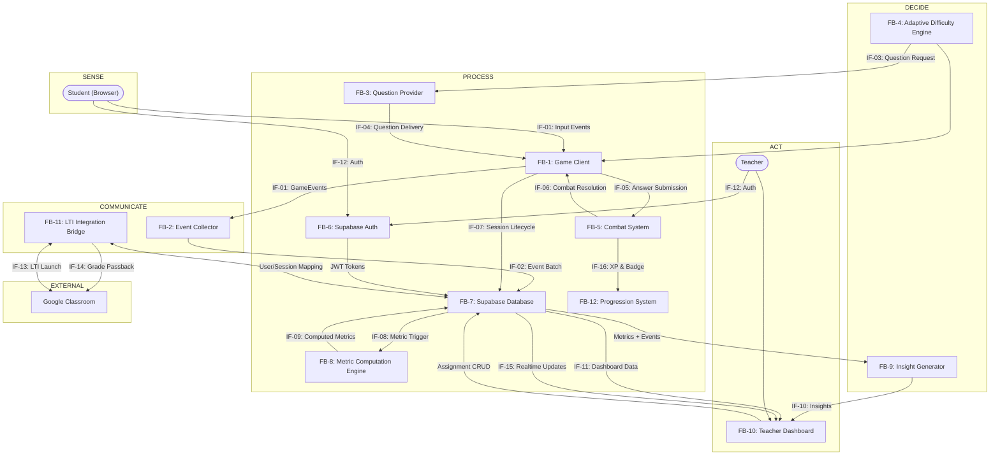
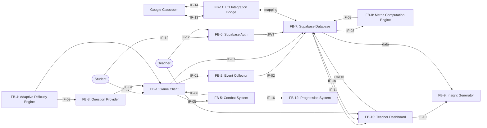

# TIE 204: MVP Studio -- Lab 3

## Interfaces & Errors

**Project:** EdGame -- Game-Based Educational Assessment Platform
**Team:** EdGame Team
**Date:** February 2026
**Course:** TIE 204: MVP Studio | Prof. Dr. Amr T. Abdel-Hamid

---

## Overview

This lab translates the lecture "Design 101: Interfaces & Errors" into concrete system-engineering practice for the EdGame platform. The guiding principle is:

> **"Interfaces are system contracts. Bad interfaces create bugs before code exists."**

EdGame is a game-based educational assessment platform where students play a KAPLAY.js game in their browser, answer curriculum-aligned questions during combat encounters, and generate rich behavioral data that is processed into actionable insights for teachers. The system spans a browser-based game client, a Supabase backend (auth, database, realtime), server-side metric computation, and a Next.js teacher dashboard -- all integrated with Google Classroom via LTI 1.3.

---

## Task 1: Functional Block Diagram

### 1.1 Functional Decomposition

The EdGame platform is decomposed into 12 functional blocks, categorized by the Sense / Communicate / Process / Decide / Act framework:

| Block ID | Block Name | Function Category | Description |
|----------|-----------|-------------------|-------------|
| FB-1 | Game Client | Sense + Act | Captures student input (clicks, keys, answer selections, timing); renders game state; presents MCQ overlays; displays HUD and visual effects |
| FB-2 | Event Collector | Communicate | Buffers raw game events in memory; batch-sends to backend every 10 seconds via HTTP POST; handles offline queuing and retry logic |
| FB-3 | Question Provider | Process | Manages question banks by subject (math/science/general) and difficulty (1--5); serves questions to game client; caches loaded question sets |
| FB-4 | Adaptive Difficulty Engine | Decide | Tracks per-player skill rating (1--5); computes target difficulty based on correctStreak/wrongStreak patterns; selects difficulty-appropriate questions |
| FB-5 | Combat System | Process + Decide | Resolves ability usage through question gate; computes power multipliers based on answer correctness and speed; applies effects (damage/heal/shield/miss) |
| FB-6 | Supabase Auth | Process | Handles user registration, login (email/password, Google OAuth, magic links); issues JWT tokens; enforces Row-Level Security policies on all database queries |
| FB-7 | Supabase Database | Process | Stores all persistent data: users, schools, game_sessions (with raw_events JSONB), assignments, classes, student_metrics_daily; provides SQL query interface |
| FB-8 | Metric Computation Engine | Process + Decide | Executes PostgreSQL functions on raw event arrays to compute 15 behavioral metrics across 6 dimensions; populates computed_metrics JSONB and daily rollup table |
| FB-9 | Insight Generator | Decide | Ranks metrics by severity/urgency; produces top-3 insights per student; compares student performance against class baselines and own historical trends |
| FB-10 | Teacher Dashboard | Act | Renders class overview, per-student drill-down, insight cards, concept mastery heatmap; sends assignment CRUD requests; receives real-time updates via WebSocket |
| FB-11 | LTI Integration Bridge | Communicate | Handles LTI 1.3 OIDC handshake with Google Classroom; maps external users to internal accounts; creates assignments from LTI deep links; sends grades back via LTI AGS |
| FB-12 | Progression System | Process | Tracks XP, levels, badges per student; computes XP from question results (factors: difficulty, speed, correctness); persists to localStorage (Phase 1) or database (Phase 2) |

### 1.2 Block Diagram

---

## Task 2: Interface List

Sixteen interfaces have been identified across the EdGame system. Each interface represents a contract between a producer and a consumer.

| Interface ID | Interface Name | Producer | Consumer | Data Exchanged | Direction |
|:------------|:--------------|:---------|:---------|:---------------|:----------|
| IF-01 | Student Input Events | Game Client (FB-1) | Event Collector (FB-2) | GameEvent objects: `{id, type, timestamp, payload}` | Unidirectional --> |
| IF-02 | Event Batch Upload | Event Collector (FB-2) | Supabase Database (FB-7) | PATCH `/api/sessions/[id]` with `events[]` array (20--100 events per batch) | Unidirectional --> |
| IF-03 | Question Request | Adaptive Difficulty Engine (FB-4) | Question Provider (FB-3) | `{subjectId, targetDifficulty, seenQuestionIds[]}` | Bidirectional <-> |
| IF-04 | Question Delivery | Question Provider (FB-3) | Game Client (FB-1) | Question object: `{id, text, options[4], correctIndex, difficulty, subject}` | Unidirectional --> |
| IF-05 | Answer Submission | Game Client (FB-1) | Combat System (FB-5) | `{questionId, selectedIndex, correctIndex, responseTimeMs, isCorrect}` | Unidirectional --> |
| IF-06 | Combat Resolution | Combat System (FB-5) | Game Client (FB-1) | `{effectType, value, success, targetId, speedMultiplier, missReason}` | Unidirectional --> |
| IF-07 | Session Lifecycle | Game Client (FB-1) | Supabase Database (FB-7) | POST `/api/sessions` (start) --> `{session_id}`; POST `/api/sessions/[id]/end` (end) --> `{computed_metrics}` | Bidirectional <-> |
| IF-08 | Metric Computation Trigger | Supabase Database (FB-7) | Metric Computation Engine (FB-8) | raw_events JSONB array from completed session (100--1000 events) | Unidirectional --> |
| IF-09 | Computed Metrics Storage | Metric Computation Engine (FB-8) | Supabase Database (FB-7) | computed_metrics JSONB: `{accuracy_by_concept, speed_accuracy_tradeoff, persistence, ...15 metrics}` | Unidirectional --> |
| IF-10 | Insight Request | Teacher Dashboard (FB-10) | Insight Generator (FB-9) | GET `/api/analytics/class/[id]/insights` --> `StudentInsight[]` per student | Bidirectional <-> |
| IF-11 | Dashboard Data Feed | Supabase Database (FB-7) | Teacher Dashboard (FB-10) | student_metrics_daily rows, aggregated views, class summary statistics | Unidirectional --> |
| IF-12 | Authentication Flow | Student/Teacher User | Supabase Auth (FB-6) | Login credentials --> JWT access_token + refresh_token; OAuth redirect flows | Bidirectional <-> |
| IF-13 | LTI Launch | Google Classroom | LTI Integration Bridge (FB-11) | LTI OIDC login initiation --> JWT validation --> resource launch parameters | Bidirectional <-> |
| IF-14 | Grade Passback | LTI Integration Bridge (FB-11) | Google Classroom | Session scores via LTI Assignment and Grade Services (AGS) | Unidirectional --> |
| IF-15 | Realtime Updates | Supabase Realtime | Teacher Dashboard (FB-10) | WebSocket push: student activity events, submission notifications, score updates | Unidirectional --> (push) |
| IF-16 | XP & Badge Update | Combat System (FB-5) | Progression System (FB-12) | `{difficulty, responseTimeMs, isCorrect}` --> `{xpGained, newLevel, badgesEarned[]}` | Bidirectional <-> |

---

## Task 3: Interface Contracts

Each interface is specified with a full contract covering data format, update rate, timing constraints, validity duration, and accuracy/precision requirements.

### IF-01: Student Input Events

| Field | Value |
|:------|:------|
| **Data** | `GameEvent: {id: UUID, type: EventType (14 types), timestamp: Unix ms, data: Record<string, unknown>}` |
| **Update Rate** | Continuous during gameplay (~2--10 events/second during active play) |
| **Timing Constraints** | Events must be timestamped within 100ms of occurrence (browser clock) |
| **Validity Duration** | Valid for current session only; stale after session end |
| **Accuracy / Precision** | Timestamps in Unix milliseconds (ms precision); responseTimeMs accurate to ~16ms (browser frame rate limit) |

### IF-02: Event Batch Upload

| Field | Value |
|:------|:------|
| **Data** | HTTP PATCH body: `{events: GameEvent[]}` -- typically 20--100 events per batch |
| **Update Rate** | Every 10 seconds during active session |
| **Timing Constraints** | Must deliver within 5 seconds of batch interval; retry with exponential backoff on failure (1s, 2s, 4s, max 3 retries) |
| **Validity Duration** | Events are idempotent (deduped by `event.id` server-side); valid until session ends |
| **Accuracy / Precision** | Batch must be complete (no partial uploads); max batch size 500 events; GZIP compression for batches > 50KB |

### IF-03: Question Request

| Field | Value |
|:------|:------|
| **Data** | Request: `{subjectId: string, targetDifficulty: integer 1-5, seenQuestionIds: string[]}`. Response: `Question` object or `null` if no match (triggers fallback) |
| **Update Rate** | 1--4 times per minute (once per combat ability activation) |
| **Timing Constraints** | Synchronous call within client runtime; must resolve within 50ms (local data lookup, no network) |
| **Validity Duration** | Returned question is valid for the current combat encounter only |
| **Accuracy / Precision** | `targetDifficulty` is an integer 1--5; `seenQuestionIds` prevents repeats within a session; exact match on difficulty preferred, +/-1 acceptable as fallback |

### IF-04: Question Delivery

| Field | Value |
|:------|:------|
| **Data** | `Question: {id: string, text: string, options: string[4], correctIndex: integer 0-3, difficulty: integer 1-5, subject: string}` |
| **Update Rate** | Same as IF-03 (1--4 times per minute) |
| **Timing Constraints** | Delivered synchronously as return value from Question Provider; MCQ overlay renders within one frame (~16ms) after receipt |
| **Validity Duration** | Valid until the student answers or the 8-second timer expires |
| **Accuracy / Precision** | `correctIndex` must exactly match the correct answer; `options` array must contain exactly 4 elements; `text` length 10--500 characters |

### IF-05: Answer Submission

| Field | Value |
|:------|:------|
| **Data** | `{questionId: string, selectedIndex: 0-3, correctIndex: 0-3, responseTimeMs: integer, isCorrect: boolean}` |
| **Update Rate** | 1--4 times per minute (one per ability activation) |
| **Timing Constraints** | Synchronous -- game state is paused until answer submitted or 8s timer expires |
| **Validity Duration** | Instant -- consumed immediately by Combat System |
| **Accuracy / Precision** | `responseTimeMs` measured from question overlay display to answer click; integer milliseconds |

### IF-06: Combat Resolution

| Field | Value |
|:------|:------|
| **Data** | `{effectType: enum (damage|heal|shield|miss), value: number, success: boolean, targetId: string, speedMultiplier: number 0.5-2.0, missReason: string|null}` |
| **Update Rate** | Same as IF-05 (1--4 times per minute; one resolution per answer submission) |
| **Timing Constraints** | Computed synchronously within one game frame (~16ms) after answer submission; visual effects may animate over 500--1500ms |
| **Validity Duration** | Instant -- effect applied to game state immediately; visual feedback is transient |
| **Accuracy / Precision** | `value` computed as `basePower * speedMultiplier`; `speedMultiplier` ranges 0.5--2.0 based on responseTimeMs relative to allowed time; floating-point precision acceptable |

### IF-07: Session Lifecycle

| Field | Value |
|:------|:------|
| **Data** | Start: POST `{environment_id, assignment_id?}` --> `{session_id, config}`. End: POST `{final_score, completed}` --> `{session_id, computed_metrics}` |
| **Update Rate** | Once at session start, once at session end (2 requests per session) |
| **Timing Constraints** | Start: <200ms response. End: <500ms response (includes metric computation) |
| **Validity Duration** | `session_id` valid for duration of gameplay session (5--25 minutes typical) |
| **Accuracy / Precision** | Score as NUMERIC; `duration_seconds` as INTEGER; `computed_metrics` as JSONB with 2-decimal floats |

### IF-08: Metric Computation Trigger

| Field | Value |
|:------|:------|
| **Data** | raw_events JSONB array from `game_sessions` table (100--1000 events, 50KB--500KB typical) |
| **Update Rate** | Once per session end |
| **Timing Constraints** | Computation must complete within 500ms (budget within the session/end API response) |
| **Validity Duration** | Computed metrics are immutable for a completed session -- never recomputed |
| **Accuracy / Precision** | Accuracy metrics: NUMERIC with 4 decimal places; response_time: INTEGER ms; counts: INTEGER |

### IF-09: Computed Metrics Storage

| Field | Value |
|:------|:------|
| **Data** | `computed_metrics` JSONB containing 15 named metrics: `{accuracy_by_concept, speed_accuracy_tradeoff, error_pattern, improvement_trajectory, mastery_threshold, time_on_task, session_frequency, completion_rate, voluntary_replay, drop_off_point, help_seeking, persistence, strategy_variation, response_to_feedback, collaboration_style}` |
| **Update Rate** | Once per session end (written as part of metric computation); daily rollup aggregates across sessions |
| **Timing Constraints** | Write must complete within the 500ms metric computation budget; daily rollup runs during off-peak hours (02:00--04:00 UTC) |
| **Validity Duration** | Per-session metrics are immutable once written; daily rollup is overwritten each day |
| **Accuracy / Precision** | Ratio metrics (accuracy, completion_rate): NUMERIC 0.0000--1.0000 (4 decimal places); time metrics: NUMERIC in minutes (2 decimal places); counts: INTEGER; JSONB objects validated against schema |

### IF-10: Insight Request

| Field | Value |
|:------|:------|
| **Data** | Request: GET `/api/analytics/class/[id]/insights`. Response: `{insights: [{student_id, insights: StudentInsight[3]}]}` |
| **Update Rate** | On dashboard load or refresh (~1--5 requests/minute per teacher) |
| **Timing Constraints** | Must respond within 500ms |
| **Validity Duration** | Insights valid for 24 hours; recomputed daily or on-demand when new sessions complete |
| **Accuracy / Precision** | Insights require minimum 3 sessions for meaningful output; include confidence qualifier if fewer |

### IF-11: Dashboard Data Feed

| Field | Value |
|:------|:------|
| **Data** | SQL query results: `student_metrics_daily` rows (one per student per day), aggregated class views, summary statistics (class average accuracy, median session count, percentile distributions) |
| **Update Rate** | On initial dashboard load (full fetch); incremental updates via IF-15 (Realtime) thereafter |
| **Timing Constraints** | Initial class overview: <400ms. Per-student drill-down: <300ms |
| **Validity Duration** | Data is current as of last session end or daily rollup; real-time updates supplement via WebSocket |
| **Accuracy / Precision** | Aggregated statistics computed server-side; percentages displayed to 1 decimal place; counts displayed as integers; date ranges in TIMESTAMPTZ (UTC) |

### IF-12: Authentication Flow

| Field | Value |
|:------|:------|
| **Data** | Login: `{email, password}` or OAuth redirect or magic link. Response: `{access_token (JWT), refresh_token, user: {id, email, role, display_name}}` |
| **Update Rate** | Once per user login session; token refresh every 55 minutes (tokens expire at 60 minutes) |
| **Timing Constraints** | Email/password login: <200ms. OAuth redirect flow: <3s total (includes external redirect). Magic link send: <300ms. Token refresh: <200ms |
| **Validity Duration** | `access_token`: 60 minutes. `refresh_token`: 7 days. Session cookie: 7 days |
| **Accuracy / Precision** | JWT contains `sub` (user UUID), `role` (student/teacher/admin), `aud`, `exp` claims; all timestamps in Unix seconds; RSA-256 signature |

### IF-13: LTI Launch

| Field | Value |
|:------|:------|
| **Data** | OIDC login initiation (`client_id`, `redirect_uri`, `nonce`, `state`) --> JWT `id_token` with LTI claims --> resource link parameters |
| **Update Rate** | Once per student assignment launch |
| **Timing Constraints** | Full handshake must complete within 5 seconds; game must begin loading within 3 seconds of launch |
| **Validity Duration** | LTI context valid for the assignment session; nonce is single-use |
| **Accuracy / Precision** | JWT validation per LTI 1.3 spec; RSA-256 signature verification |

### IF-14: Grade Passback

| Field | Value |
|:------|:------|
| **Data** | LTI AGS score submission: `{scoreGiven: number 0-100, scoreMaximum: 100, activityProgress: enum (Initialized|Started|InProgress|Submitted|Completed), gradingProgress: enum (FullyGraded|Pending), userId: string, timestamp: ISO 8601}` |
| **Update Rate** | Once per completed game session (asynchronous, after session end processing) |
| **Timing Constraints** | Must be sent within 60 seconds of session end; no user-facing latency requirement (background job) |
| **Validity Duration** | Grade is final once submitted; updates overwrite previous grade for same assignment-student pair |
| **Accuracy / Precision** | `scoreGiven` as float with 1 decimal place (0.0--100.0); maps from internal score using linear normalization |

### IF-15: Realtime Updates

| Field | Value |
|:------|:------|
| **Data** | WebSocket messages: `{event: string (INSERT|UPDATE), table: string, new: Row, old: Row|null}` for tables: `game_sessions`, `student_metrics_daily` |
| **Update Rate** | Event-driven; typically 0--10 messages/minute per subscribed class during active play |
| **Timing Constraints** | Messages delivered within 1 second of database change; dashboard UI updates within 500ms of message receipt |
| **Validity Duration** | Each message is a point-in-time notification; dashboard should not rely solely on realtime -- initial load fetches full state |
| **Accuracy / Precision** | Row data matches database state at time of change; eventual consistency (message may arrive before or after REST API reflects same change) |

### IF-16: XP & Badge Update

| Field | Value |
|:------|:------|
| **Data** | Input: `{difficulty: integer 1-5, responseTimeMs: integer, isCorrect: boolean}`. Output: `{xpGained: integer, newTotalXp: integer, newLevel: integer, badgesEarned: Badge[]}` where `Badge: {id: string, name: string, description: string}` |
| **Update Rate** | Same as IF-05/IF-06 (1--4 times per minute; once per question answered) |
| **Timing Constraints** | Computed synchronously within client runtime; must complete within 5ms (simple arithmetic) |
| **Validity Duration** | XP and level are cumulative and persistent; badges once earned are permanent |
| **Accuracy / Precision** | XP formula: `basexp * difficultyMultiplier * speedBonus * correctnessMultiplier`; all intermediate values as integers (no floating-point XP); level thresholds defined as integer XP values |

---

## Task 4: Data Structures

### 4.1 GameEvent

| Property | Value |
|:---------|:------|
| **Type Classification** | **Event** |
| **Fields** | `id` (UUID), `session_id` (UUID), `timestamp` (Unix ms), `type` (EventType enum -- 14 values: `session_start`, `session_end`, `question_presented`, `question_answered`, `hint_requested`, `hint_viewed`, `level_started`, `level_completed`, `achievement_earned`, `error_made`, `retry_attempted`, `idle_detected`, `focus_lost`, `focus_regained`), `data` (JSON object with type-specific payload) |
| **Range** | `timestamp`: 0 to 2^53; `type`: one of 14 enum values |
| **Update** | Continuous during gameplay (2--10 events/second) |
| **Owner** | Game Client (FB-1) |
| **Consumers** | Event Collector (FB-2), Metric Computation Engine (FB-8) |

### 4.2 computed_metrics

| Property | Value |
|:---------|:------|
| **Type Classification** | **Measurement** (aggregated) |
| **Fields** | 15 named metrics: `accuracy_by_concept` (JSONB), `speed_accuracy_tradeoff` (NUMERIC), `error_pattern` (JSONB), `improvement_trajectory` (NUMERIC), `mastery_threshold` (TEXT[]), `time_on_task` (NUMERIC, minutes), `session_frequency` (INTEGER), `completion_rate` (NUMERIC, 0--1), `voluntary_replay` (INTEGER), `drop_off_point` (TEXT), `help_seeking` (INTEGER), `persistence` (INTEGER), `strategy_variation` (INTEGER), `response_to_feedback` (NUMERIC), `collaboration_style` (ENUM -- Phase 2) |
| **Range** | Accuracy: 0.0--1.0; time_on_task: 0--infinity minutes; response_time: 0--30000ms; counts: 0--infinity |
| **Update** | Once per session end + daily rollup |
| **Owner** | Metric Computation Engine (FB-8) |
| **Consumers** | Insight Generator (FB-9), Teacher Dashboard (FB-10) |

### 4.3 StudentInsight

| Property | Value |
|:---------|:------|
| **Type Classification** | **Command** (action recommendation) |
| **Fields** | `type` (enum: `struggling` | `excelling` | `needs_attention` | `improving`), `metric` (string -- name of triggering metric), `message` (string -- human-readable, 10--200 chars), `action` (string -- recommended teacher action, 10--200 chars) |
| **Range** | `type`: one of 4 values; `message` and `action` are natural language strings |
| **Update** | On dashboard load or daily cron |
| **Owner** | Insight Generator (FB-9) |
| **Consumers** | Teacher Dashboard (FB-10) |

### 4.4 Question

| Property | Value |
|:---------|:------|
| **Type Classification** | **Configuration** |
| **Fields** | `id` (string), `subject` (enum: `math` | `science` | `general`), `difficulty` (integer 1--5), `text` (string), `options` (string[4]), `correctIndex` (integer 0--3) |
| **Range** | `difficulty`: 1--5; `correctIndex`: 0--3; `text`: 10--500 chars; each option: 1--200 chars |
| **Update** | Static in Phase 1 (JSON files); dynamic in Phase 2 (API-provided, teacher-configurable) |
| **Owner** | Question Provider (FB-3) |
| **Consumers** | Adaptive Difficulty Engine (FB-4), Game Client (FB-1) |

### 4.5 SessionRecord

| Property | Value |
|:---------|:------|
| **Type Classification** | **State** |
| **Fields** | `id` (UUID), `student_id` (UUID), `assignment_id` (UUID, nullable), `environment_id` (UUID), `started_at` (TIMESTAMPTZ), `ended_at` (TIMESTAMPTZ, nullable), `duration_seconds` (INTEGER), `completed` (BOOLEAN), `score` (NUMERIC), `raw_events` (JSONB -- array of GameEvent), `computed_metrics` (JSONB -- 15 metrics) |
| **Range** | `duration`: 0--3600 seconds; `score`: 0--infinity |
| **Update** | Created at session start, updated during play (events appended), finalized at session end |
| **Owner** | Supabase Database (FB-7) |
| **Consumers** | Metric Computation Engine (FB-8), Teacher Dashboard (FB-10), Student (read own) |

### 4.6 Assignment

| Property | Value |
|:---------|:------|
| **Type Classification** | **Configuration** |
| **Fields** | `id` (UUID), `teacher_id` (UUID), `environment_id` (UUID), `class_id` (UUID), `title` (string), `instructions` (string, nullable), `due_at` (TIMESTAMPTZ, nullable), `config` (JSONB -- difficulty range, time limit, concepts) |
| **Range** | `title`: 1--200 chars; `instructions`: 0--2000 chars; `config.difficulty_range`: [1--5, 1--5] |
| **Update** | Created/updated by teacher; read by students |
| **Owner** | Teacher (via Dashboard FB-10) |
| **Consumers** | Game Client (FB-1), Supabase Database (FB-7) |

---

## Task 5: Ownership Mapping

| Data Item | Owner | Who Updates | Who Reads | Who Can Modify |
|:----------|:------|:-----------|:----------|:---------------|
| Raw game events | Game Client (FB-1) | Game Client (creates + appends) | Event Collector (FB-2), Backend (FB-7) | Game Client only (append-only, immutable once sent) |
| Session record | Supabase Database (FB-7) | Game Client (start/end), Metric Engine (computed_metrics) | Teacher Dashboard (FB-10), Student (own sessions) | Backend only (via authenticated API) |
| computed_metrics | Metric Computation Engine (FB-8) | PostgreSQL function (on session end -- once) | Teacher Dashboard (FB-10), Insight Generator (FB-9) | Metric Engine only (immutable after computation) |
| Student insights | Insight Generator (FB-9) | Insight Generator (daily cron or on-demand) | Teacher Dashboard (FB-10) | Insight Generator only (regenerated, not edited) |
| Question bank | Question Provider (FB-3) | Admin (Phase 2: CRUD via API) | Game Client (FB-1), Adaptive Engine (FB-4) | Admin only (Phase 1: read-only JSON files) |
| User profile & auth | Supabase Auth (FB-6) | Auth system (registration, token refresh) | All authenticated services (via JWT) | Auth system + user (own profile fields) |
| Progression (XP/level/badges) | Progression System (FB-12) | Combat System (via `grantQuestionXp` after each answer) | Game Client HUD, Post-game screen | Progression System only (computed, not manually editable) |
| Assignment config | Teacher (via FB-10) | Teacher (CRUD operations) | Students (read-only for assigned games) | Teacher who created it (+ school admin in Phase 2) |
| Class roster | Teacher (via FB-10) | Teacher (add/remove students), Students (join via code) | Teacher Dashboard (FB-10), Backend (FB-7) | Teacher (full CRUD) + Student (join/leave only) |
| Daily metrics rollup | Metric Computation Engine (FB-8) | Daily cron job (aggregates from individual sessions) | Teacher Dashboard (FB-10), Insight Generator (FB-9) | System only (automated aggregation) |

---

## Task 6: Blocking vs Non-Blocking Analysis

| Interface | Blocking? | What Is It Waiting For? | Can Both Sides Wait? | Deadlock Risk? |
|:----------|:----------|:-----------------------|:---------------------|:---------------|
| IF-01: Student Input Events | **Non-blocking** | Nothing; fire-and-forget into event buffer | No -- producer never waits | No |
| IF-02: Event Batch Upload | **Non-blocking** | HTTP response; game continues regardless of upload success | No -- game never blocks on upload | No; retry on failure with backoff |
| IF-03: Question Request | **Blocking** (client-side) | Question must be loaded before MCQ overlay can appear | No -- Adaptive Engine is synchronous call within client | No; fallback to random question if filter returns empty set |
| IF-04: Question Delivery | **Blocking** (client-side) | Game overlay waits for question object | No -- synchronous within client runtime | No; question provider always returns (fallback exists) |
| IF-05: Answer Submission | **Blocking** | Game state paused on MCQ overlay until student answers or 8s timer expires | No -- student controls resolution | No; **8-second timer forces resolution** -- prevents infinite block |
| IF-06: Combat Resolution | **Non-blocking** | Effect is applied synchronously but game loop continues immediately after | No | No |
| IF-07: Session Start | **Blocking** | Must receive `session_id` before game begins | No -- server always responds | No; client generates local UUID as fallback if server unreachable |
| IF-07: Session End | **Blocking** | Waits for `computed_metrics` in response | No -- single-direction request | No; timeout at 5s with graceful degradation (show results without server metrics) |
| IF-08: Metric Trigger | **Blocking** (within API response) | Computation must finish before POST `/sessions/[id]/end` returns | No -- PostgreSQL function executes synchronously | No; single-direction flow, computation has 500ms budget |
| IF-10: Insight Request | **Blocking** | Teacher waits for dashboard to load with insights | No -- server computes and returns | No; cached results served within 500ms; stale cache returned if computation fails |
| IF-11: Dashboard Data | **Non-blocking** (after initial load) | Realtime updates pushed asynchronously | No | No |
| IF-12: Auth Flow | **Blocking** | User waits for login response / OAuth redirect | No -- standard request-response | No; timeout at 10s, show error message |
| IF-13: LTI Launch | **Blocking** | Must complete OIDC handshake before game loads | No -- sequential handshake | No; timeout at 15s, show "return to Google Classroom" error |
| IF-14: Grade Passback | **Non-blocking** | Sent asynchronously after session end; no user waiting | No | No |
| IF-15: Realtime Updates | **Non-blocking** | WebSocket push; dashboard updates asynchronously | No | No |
| IF-16: XP/Badge Update | **Non-blocking** | Computed synchronously in client but does not block game loop | No | No |

---

## Task 7: Interface Failure Modes

| Interface | Failure Type | How Detected | System Reaction |
|:----------|:------------|:-------------|:----------------|
| IF-02: Event Batch | **Timeout** (server unresponsive) | HTTP request exceeds 5s | Queue events locally in memory; retry with exponential backoff (1s, 2s, 4s); max 3 retries; if all fail, persist to localStorage for later sync |
| IF-02: Event Batch | **Overflow / Backpressure** (buffer too large) | In-memory event buffer exceeds 500 events | Force immediate flush; if flush fails, drop oldest events; always retain most recent 200 events |
| IF-03: Question Request | **Missing data** (no questions match difficulty) | Filter returns empty array | Fall back to any unseen question in same subject; if all seen, reset seen-set and pick random; always return a question |
| IF-03: Question Request | **Invalid data** (malformed question JSON) | Schema validation fails on question object | Skip malformed question; log error; select next valid question from pool |
| IF-07: Session Start | **Timeout** (server unreachable) | POST `/api/sessions` exceeds 3s | Generate local session UUID; buffer all events locally; sync when connectivity returns |
| IF-07: Session End | **Timeout** (metric computation exceeds budget) | POST `/api/sessions/[id]/end` exceeds 5s | Show results screen with client-side stats only; mark session for async metric recomputation |
| IF-08: Metric Trigger | **Invalid data** (empty or malformed raw_events) | raw_events array is empty or fails validation | Skip metric computation; mark session as `incomplete_metrics`; alert admin via error log |
| IF-10: Insight Request | **Timeout** (insight computation slow) | GET `/api/analytics/*/insights` exceeds 500ms | Return cached insights from last successful computation; show "insights may be outdated" badge |
| IF-12: Auth Flow | **Token expired** (JWT past expiry) | 401 response from any Supabase endpoint | Automatically attempt token refresh using refresh_token; if refresh fails, redirect to login screen |
| IF-12: Auth Flow | **OAuth failure** (Google OAuth error) | Error callback from OAuth provider | Show human-readable error message; offer alternative login method (email/password or magic link) |
| IF-13: LTI Launch | **Invalid JWT** (signature verification fails) | JWT verification against JWKS endpoint fails | Show error page with "Return to Google Classroom" link; log detailed error for debugging |
| IF-13: LTI Launch | **User mapping failure** (LTI user not in system) | No matching user found by external ID | Auto-create user account from LTI claims (email, name, role); assign to class based on LTI context |
| IF-14: Grade Passback | **LMS rejection** (invalid score format) | LTI AGS returns 400/422 | Log error; retry once with reformatted score; if still fails, flag for manual grade entry |
| IF-15: Realtime Updates | **WebSocket disconnect** | Connection lost event | Automatic reconnection with exponential backoff; poll REST API as fallback while disconnected |
| IF-02 + IF-07 | **Network offline** (no internet) | `navigator.onLine === false` or fetch fails | Game continues in offline mode; all events buffered in localStorage; sync automatically when connection restores; show subtle "offline" indicator |

---

## Task 8: Interface Dependency Graph

**Cycle Check:** The dependency graph is a DAG (directed acyclic graph). Data flows unidirectionally from Student --> Game Client --> Backend --> Dashboard --> Teacher. No two subsystems mutually wait on each other in a blocking fashion. The only bidirectional interfaces (IF-03, IF-07, IF-10, IF-12, IF-13, IF-16) are request-response patterns with timeouts -- they cannot create circular waits.

---

## Task 9: Error Classification

### Possible Deadlock? **No.**

All cross-system interfaces are either non-blocking (event batching, realtime push) or have explicit timeouts that force resolution:

- **MCQ overlay:** 8-second timer auto-resolves if student does not answer
- **API calls:** 3--5 second timeouts with fallback behavior (local UUID generation, client-side stats display)
- **Auth flows:** 10-second timeout with redirect to login screen
- **LTI handshake:** 15-second timeout with "return to Google Classroom" error page

No two subsystems mutually wait on each other. The question overlay is the only interface that blocks the game loop, and the forced 8-second timer prevents indefinite waiting. All server-side computations (metric computation, insight generation) execute within bounded time budgets.

### Possible Livelock? **Yes, theoretically -- mitigated.**

The Adaptive Difficulty Engine could theoretically oscillate if a student is at a difficulty boundary:

1. 3 correct answers --> difficulty increases
2. 2 wrong answers --> difficulty decreases
3. 3 correct answers --> difficulty increases
4. Repeat indefinitely

This would cause the student to experience rapid difficulty swings without stable progression, effectively "stuck" without making forward progress despite continuous activity -- the hallmark of livelock.

**Mitigation:** The skill rating uses weighted smoothing (0.15 increment for correct, 0.2 decrement for wrong) with an accuracy-based correction factor. This dampens oscillation. Additionally, the streak thresholds (3 correct to increase, 2 wrong to decrease) create hysteresis that prevents single-answer oscillation. The asymmetric weights mean the system biases slightly toward maintaining challenge rather than reducing it, which prevents the student from being trapped in a low-difficulty loop.

### Possible Starvation? **No.**

All students have equal access to game sessions, question banks, and dashboard visibility. Specific safeguards include:

- The batch upload uses bounded retries (max 3) to prevent infinite retry loops from consuming resources
- The daily metrics rollup processes all students equally via scheduled cron job -- no student is deprioritized
- No student or teacher can monopolize server resources -- rate limiting (100 reads/min, 30 writes/min) ensures fair access
- The question bank is shared equally; the Adaptive Difficulty Engine selects questions based on individual skill level, not priority or queue order
- WebSocket subscriptions are per-class, ensuring all teachers in the same class receive identical real-time updates

---

## Task 11: Interface-Driven Team Split

| Team Member | Subsystem Owned | Interfaces They Must Respect |
|:-----------|:----------------|:-----------------------------|
| **Member A (Game Developer)** | Game Client (FB-1), Combat System (FB-5), Adaptive Difficulty Engine (FB-4), Question Provider (FB-3), Progression System (FB-12), Event Collector (FB-2) | IF-02 (must send events in agreed batch format), IF-07 (must call session start/end API with correct payload), IF-12 (must handle JWT tokens from auth system) |
| **Member B (Backend + Dashboard Developer)** | Supabase Database (FB-7), Metric Computation Engine (FB-8), Insight Generator (FB-9), Teacher Dashboard (FB-10), Supabase Auth (FB-6), LTI Integration Bridge (FB-11) | IF-02 (must accept event batch format), IF-07 (must serve session API with correct response), IF-10 (must serve insights endpoint), IF-13/IF-14 (must implement LTI contracts) |

### Shared Boundary

The **Event Collector (FB-2)** and the **Session Lifecycle API (IF-07)** are the critical integration points:

- **Member A** implements the client-side event buffer, batch logic, session start/end calls, and all in-browser game logic (combat, questions, progression, difficulty adaptation).
- **Member B** implements the server-side PATCH endpoint that receives event batches, the session API, metric computation, insight generation, the teacher dashboard, authentication, and LTI integration.

The interface contracts -- particularly **IF-02** (Event Batch Upload) and **IF-07** (Session Lifecycle) -- are the contracts both members must honor. These contracts define the exact HTTP methods, request/response shapes, timing guarantees, and error handling behaviors that allow both sides to develop and test independently.

### Rule

> "No one owns the whole system. Each person owns a subsystem and its interfaces."

Both team members can develop and test their subsystems independently by mocking the shared interfaces. Member A can mock the backend API responses. Member B can mock the game client event streams. Integration testing validates that both implementations honor the same contracts.

---

## Teacher Value Callout

> **Why Interfaces Matter for Teachers:** Every interface in this system exists to ensure that data flows reliably from the moment a student answers a question in-game to the moment a teacher sees an actionable insight on their dashboard. If IF-02 (event batch upload) fails silently, teachers lose visibility into student behavior. If IF-08 (metric computation) produces wrong values, teachers get misleading recommendations. If IF-10 (insight delivery) is too slow, teachers won't check the dashboard. By defining explicit contracts with timing guarantees, failure handling, and data ownership, we ensure that the promise -- "assign a 15-minute game, get 10x the insight of a worksheet" -- is reliable enough for teachers to depend on daily.

---

## Deliverables Checklist

| Deliverable | Location in Document |
|:-----------|:---------------------|
| Functional block diagram | Task 1 (Section 1.2 -- Mermaid diagram) |
| Interface list and contracts | Task 2 (16 interfaces) + Task 3 (16 detailed contracts) |
| Data models and ownership tables | Task 4 (6 data structures) + Task 5 (10-row ownership table) |
| Interface error analysis | Task 7 (15 failure mode entries across all critical interfaces) |
| Deadlock / livelock / starvation reasoning | Task 9 (3 classifications with detailed analysis) |
| Team split table | Task 11 (2-member split with shared boundary analysis) |
