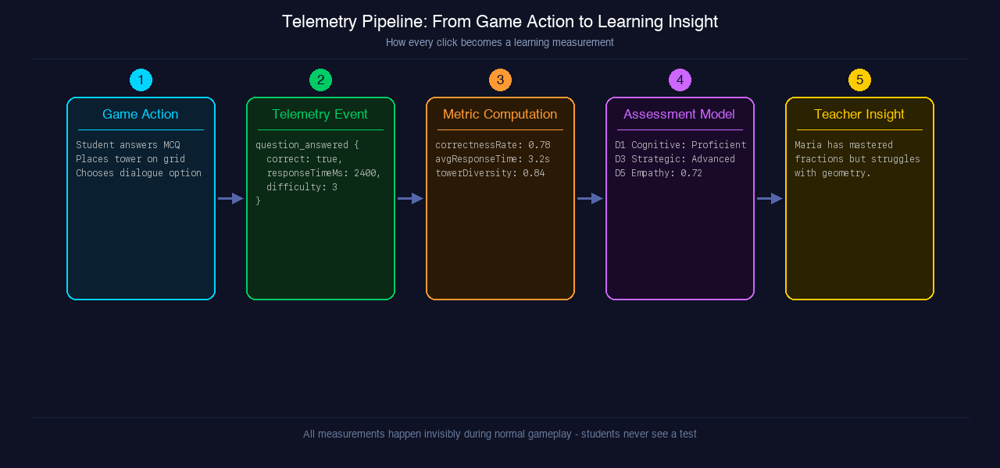
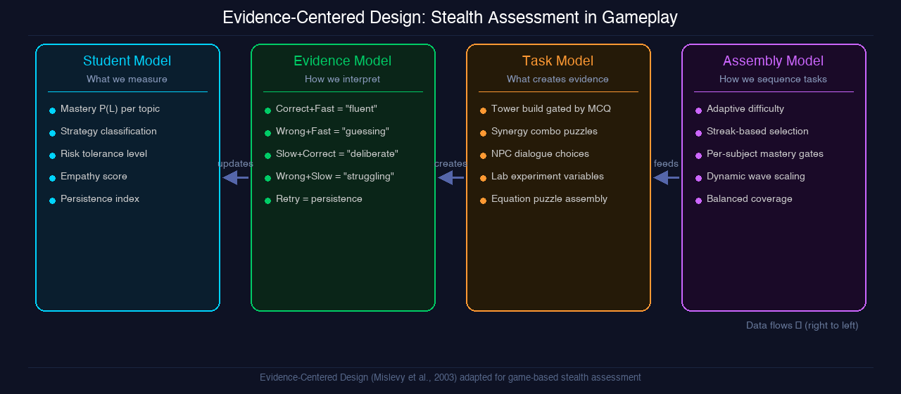
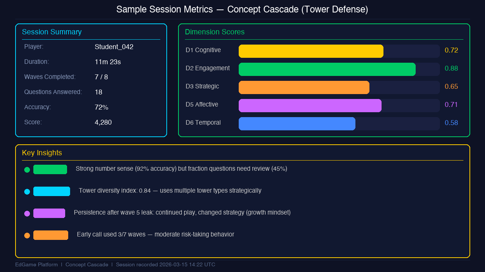
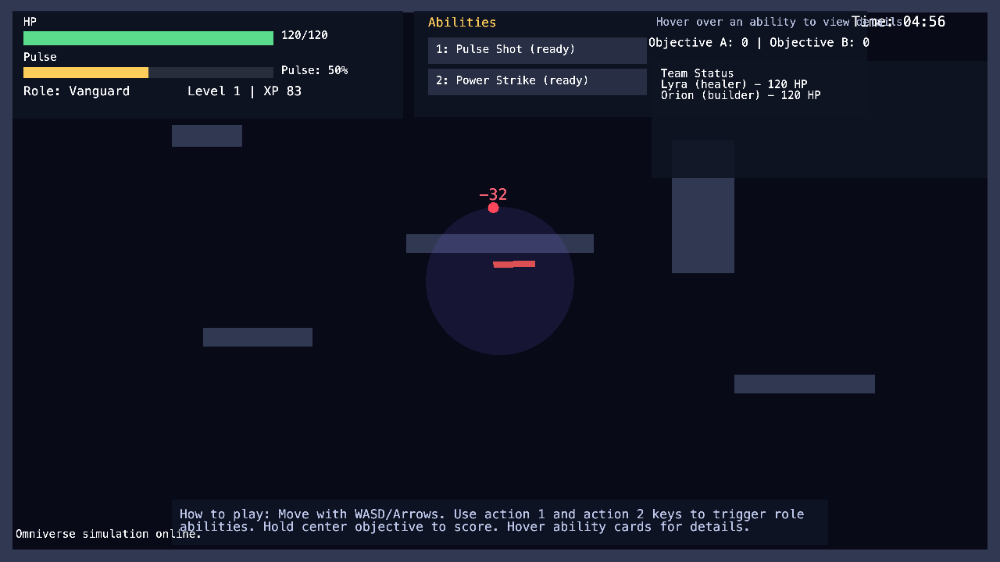
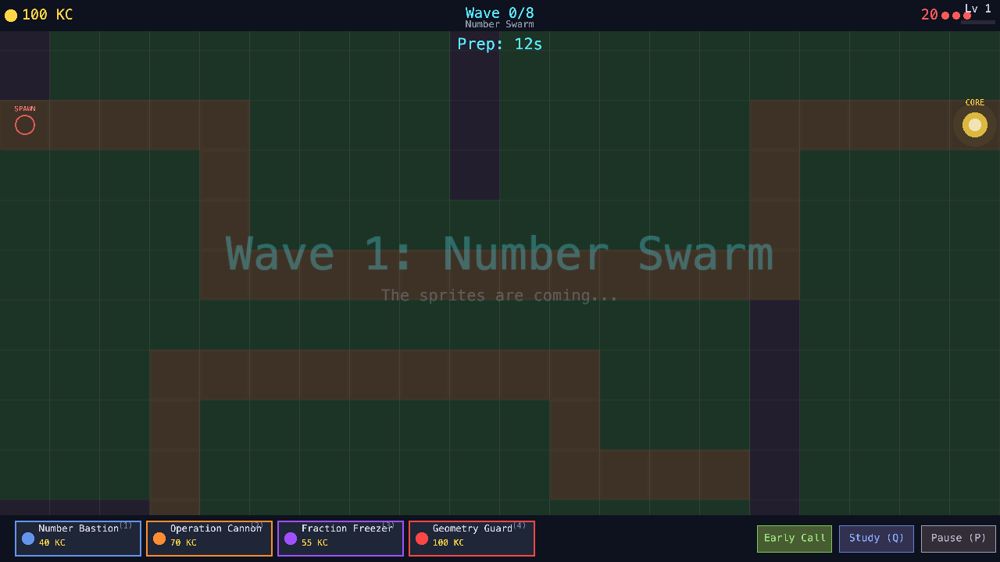
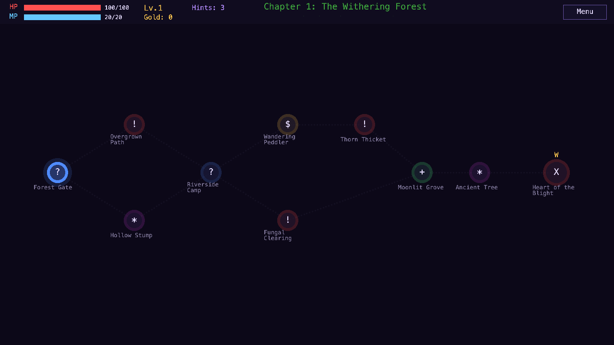
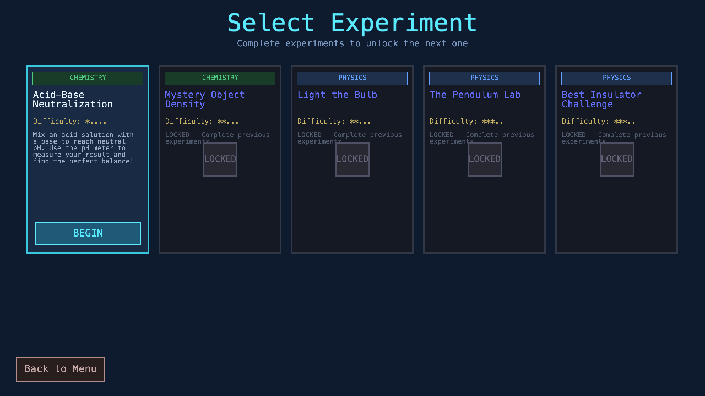
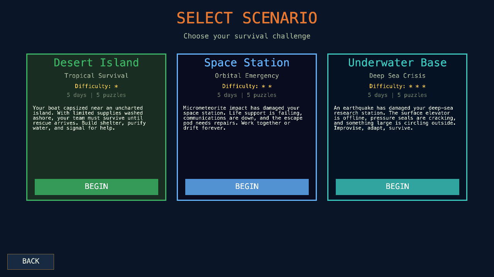
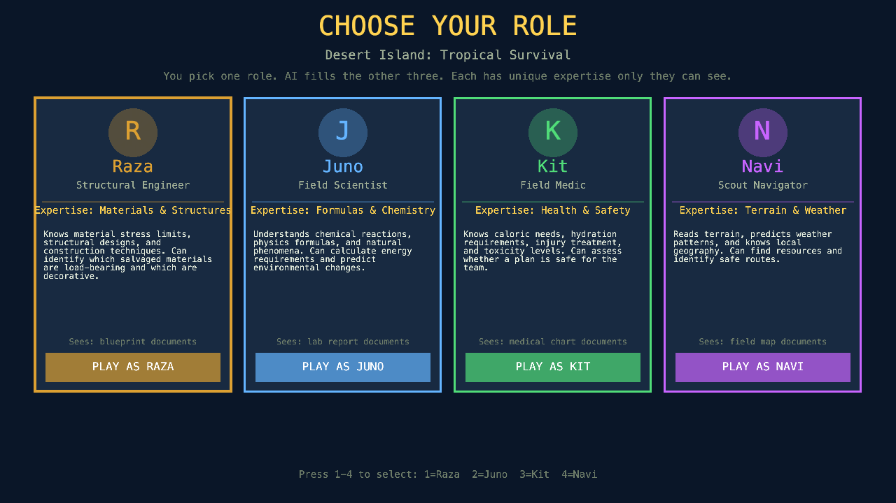

# EdGame Analytics Platform - Progress Report

**Author:** Yousef Radwan | **Course:** TIE 251 - Capstone Computing Studies | **Institution:** KAUST
**Date:** April 2026 | **Version:** 2.0

---

## Executive Summary

The EdGame Analytics Platform has reached a major milestone: **all five educational games are now fully implemented** as playable KAPLAY.js browser games. Each game embeds stealth assessment through Evidence-Centered Design (ECD), measuring student competencies across six analytics dimensions without interrupting gameplay. A total of **164 source files** comprising approximately **32,100 lines of code** deliver five distinct game experiences spanning tower defense, turn-based RPG, virtual science lab, and collaborative puzzle survival genres.

This report presents each game with live gameplay screenshots, details the telemetry pipeline that converts every player action into a learning insight, and explains the ECD framework that makes it all invisible to students.

---

## How Stealth Assessment Works

The core innovation of EdGame is that **assessment and gameplay are indistinguishable**. Students never see a test -- they play games. Every click, every decision, every hesitation is silently captured and analyzed.

### The Telemetry Pipeline



*Every game action flows through five stages: from a student clicking an answer, through structured telemetry events, metric computation, assessment modeling, and finally into actionable teacher insights. All of this happens invisibly during normal gameplay.*

The pipeline works in real-time:
1. **Game Action**: A student answers a math question to build a tower, casts an RPG spell, or adjusts an experiment variable
2. **Telemetry Event**: The action is captured as a structured JSON event with context (e.g., `{correct: true, responseTimeMs: 2400, difficulty: 3, context: "tower_build"}`)
3. **Metric Computation**: Raw events are aggregated into meaningful metrics (correctness rate, response time trends, strategy diversity)
4. **Assessment Model**: Metrics are mapped to the six analytics dimensions using Evidence-Centered Design (e.g., D1 Cognitive: Proficient, D3 Strategic: Advanced)
5. **Teacher Insight**: Dimension scores become actionable recommendations (e.g., "Maria has mastered fractions but struggles with geometry")

### Evidence-Centered Design Framework



*The four interconnected ECD models: the Assembly Model sequences game tasks adaptively, the Task Model creates situations that elicit evidence (e.g., tower placement decisions, dialogue choices), the Evidence Model interprets observations (e.g., fast+correct = "fluent"), and the Student Model maintains probabilistic mastery estimates.*

### Sample Session Analytics



*A sample analytics dashboard for one student's Concept Cascade session showing: session summary (72% accuracy, 7/8 waves), dimension scores (D1-D6 as colored bars), and key insights including concept-specific mastery gaps, strategy indicators, and growth mindset observations.*

---

## The Five Games

### Platform Metrics

| Metric | Value |
|--------|-------|
| Total Games | 5 |
| Total Source Files | 164 |
| Total Lines of Code | ~32,100 |
| Total Question Bank | 410 questions across 10 JSON files |
| Analytics Dimensions Covered | All 6 (D1-D6) |
| Engine | KAPLAY.js (browser-based, no install required) |

---

## Game 1: Pulse Realms - Team Arena

**Genre:** 3v3 Team Arena | **Subject:** Math & Science | **Primary Dimension:** D4 Social
**Duration:** 5 min per match | **Files:** 25



*Live gameplay: The arena scene showing the player (Vanguard role) with HP/Pulse bars, two abilities (Pulse Shot and Power Strike), team status (Lyra the healer, Orion the builder), objective circle, match timer, and a -32 damage number from combat. Walls create tactical cover positions.*

### How It Plays

Players choose one of three combat roles and join a 3v3 team battle. Every ability is gated behind an MCQ -- answering correctly fires the ability, and answering *quickly* amplifies its power up to 2x through a speed multiplier. The central objective must be held to score points.

### What It Measures (Invisibly)

Every combat action generates telemetry that feeds the assessment pipeline:

| Player Action | Telemetry Event | What It Reveals |
|--------------|----------------|-----------------|
| Answers MCQ correctly in 2.1s | `question_answered {correct: true, responseTimeMs: 2100}` | Speed-accuracy profile: "fluent" |
| Heals teammate instead of attacking | `action_performed {actionType: "heal", targetId: "ally_bot_1"}` | Prosocial behavior (D4) |
| Keeps fighting after taking damage | `action_performed` events after `damage_taken` | Persistence under pressure (D5) |
| Chooses Healer role 3 sessions in a row | `game_started {role: "healer"}` across sessions | Strategic preference (D3) |

---

## Game 2: Concept Cascade - Tower Defense

**Genre:** Tower Defense | **Subject:** Mathematics | **Primary Dimension:** D3 Strategic
**Duration:** 10-15 min | **Files:** 32 | **Lines:** ~5,600



*Live gameplay: The tower defense battlefield during Wave 1 prep phase (12 seconds remaining). The tile grid shows buildable areas (dark green), path tiles (brown), spawn point (left), and Knowledge Core (right, gold circle). Bottom panel shows four tower types with costs: Number Bastion (40 KC), Operation Cannon (70 KC), Fraction Freezer (55 KC), Geometry Guard (100 KC). Right side has Early Call, Study, and Pause buttons.*

### How It Plays

Players defend a Knowledge Core against 8 waves of math-themed enemies by building towers. Each tower build requires answering a math question. Wrong answers refund half the cost -- failure is a learning signal, not a punishment. Towers near each other can trigger hidden synergy combos (e.g., "Shatter Shot": frozen enemies take 3x damage from the sniper tower).

### What It Measures (Invisibly)

| Player Action | Assessment Signal |
|--------------|------------------|
| Builds only Number Bastions | Tower diversity: 0.0 -- rigid, single-strategy thinking |
| Discovers 3 synergy combos | Systems thinking -- understands emergent interactions |
| Uses Early Call on 5/7 waves | Risk-taking propensity -- willing to gamble for rewards |
| Changes tower mix after Wave 5 leak | Strategy adaptation -- productive persistence |
| Fraction Phantoms keep breaking through | Concept gap: fractions (correlate with question accuracy per subject) |

**Key insight:** The game distinguishes between "bad strategy" (wrong tower placement) and "knowledge gap" (wrong answers on fraction questions) by correlating tower choices with per-subject accuracy.

---

## Game 3: Knowledge Quest - Turn-Based RPG

**Genre:** Turn-Based RPG | **Subject:** Math & Science | **Primary Dimension:** D5 Affective/SEL
**Duration:** 15-25 min per chapter | **Files:** 38 | **Lines:** ~10,200



*Live gameplay: The Slay-the-Spire-style branching chapter map for "The Withering Forest." Color-coded nodes show different encounter types: red exclamation marks (combat), gold dollar sign (shop/Wandering Peddler), blue question marks (mystery/Forest Gate, Riverside Camp), green plus (rest/Moonlit Grove), purple star (special/Ancient Tree), and dark X (boss/Heart of the Blight). Player stats at top: HP 100/100, MP 20/20, Lv.1, 3 Hints, 0 Gold.*

### How It Plays

Students traverse branching maps choosing their path through combat, dialogue, shops, and mystery events. Combat uses question-gated spells with a Paper Mario-style timing minigame (PERFECT = 2x damage). Eight collectible Knowledge Companions level up as students answer questions in their domain. Six social dilemmas test empathy vs. self-interest with visible world consequences.

### What It Measures (Invisibly)

| Player Action | Assessment Signal |
|--------------|------------------|
| Helps the lost merchant (costs time) | Prosocial choice -- empathy indicator (D5) |
| Takes the harder mountain path | Risk-taking, growth mindset (D5) |
| Uses all 3 hints in first combat | Help-seeking: dependent pattern (D5) |
| Uses 1 hint, then solves alone | Help-seeking: strategic pattern (D5) |
| Spares the sleeping Apathy Giant | Non-violent approach -- empathy (D5) |
| Accuracy drops when HP is low | Emotional regulation under pressure (D5) |
| Retries after combat loss with new strategy | Growth mindset indicator (D5) |

**Key insight:** The social dilemma choices create a hidden "empathy score" -- the ratio of prosocial to self-interest decisions across all encounters. This score is never shown to the student; it appears only on the teacher dashboard.

---

## Game 4: Lab Explorer - Virtual Science Lab

**Genre:** Science Simulation | **Subject:** Chemistry & Physics | **Primary Dimension:** D3 Strategic
**Duration:** 15-20 min | **Files:** 31 | **Lines:** ~5,700



*Live gameplay: The experiment selection screen showing five science experiments: "Acid-Base Neutralization" (Chemistry, 1 star), "Mystery Object Density" (Physics, 2 stars), "Light the Bulb" (Physics, 2 stars), "The Pendulum Lab" (Physics, 3 stars), and "Best Insulator Challenge" (Physics/Chemistry, 3 stars). Each card shows subject, difficulty, and lock state -- later experiments unlock as earlier ones are completed.*

### How It Plays

Students conduct five real experiments through a six-phase loop: form hypothesis, select equipment, manipulate variables, run experiment, observe results, draw conclusions. Wrong experiments produce spectacular failures (foam eruptions, sparks, string breaks) that are entertaining and educational -- collected in a "Disaster Gallery" as achievements. Hidden discoveries reward exploration beyond the minimum.

### What It Measures (Invisibly)

| Player Action | Assessment Signal |
|--------------|------------------|
| Changes only one variable per run | Systematic experimentation (D3) -- strong scientific process |
| Changes 3 variables simultaneously | Random experimentation (D3) -- needs scaffolding |
| Tries pH = 1 (extreme value) | Curiosity-driven exploration (D3) |
| Adjusts approach after unexpected result | Self-correction rate (D3) |
| Selects thermometer for pH experiment | Equipment knowledge gap (D1) -- triggers educational MCQ |
| Forgets safety goggles | Safety awareness metric (D5) |
| Finds "Galileo's Insight" discovery | Explored beyond minimum -- intrinsic motivation (D2) |

**Key insight:** The system logs the complete action sequence ("process trace") for each experiment. Process mining algorithms detect whether students follow systematic scientific method or trial-and-error approaches.

---

## Game 5: Survival Equation - Collaborative Puzzle Survival

**Genre:** Cooperative Puzzle | **Subject:** Applied Math & Science | **Primary Dimension:** D4 Social
**Duration:** 15-20 min per scenario | **Files:** 38 | **Lines:** ~6,700



*Live gameplay: Scenario selection showing three survival environments -- "Desert Island" (Beginner, 15-20 min), "Space Station" (Intermediate), and "Underwater Base" (Advanced). Each card describes the scenario premise and has a difficulty rating and BEGIN button.*



*Live gameplay: Role assignment screen with four specialist roles. Each card shows the team member's name, portrait, expertise, and description: Raza the Engineer (materials and structures), Juno the Scientist (formulas and analysis), Kit the Medic (health and safety), Navi the Navigator (terrain and weather). Players choose one role; AI fills the rest.*

### How It Plays

Four specialists with exclusive information must communicate to solve survival puzzles. The Engineer sees material specs but not formulas; the Scientist sees formulas but not terrain maps. No single role can solve any puzzle alone. AI partners respond with personality-driven dialogue (the confident Engineer overestimates, the nervous Medic double-checks everything). A day countdown creates natural dramatic tension.

### What It Measures (Invisibly)

| Player Action | Assessment Signal |
|--------------|------------------|
| Asks "What materials do we have?" | Information request -- proactive communication (D4) |
| Shares own data without being asked | Proactive information sharing (D4) |
| Makes 70% of the proposals | Leadership pattern -- high initiative (D4) |
| Distributes food equally | Resource fairness -- equity-oriented (D5) |
| Takes extra rations for self | Resource hoarding -- self-interest (D5) |
| Waits for team input before solving | Patience indicator -- collaborative mindset (D4) |
| Rushes solution without asking team | Impulsive behavior -- needs collaboration practice (D4) |

**Key insight:** The Gini coefficient is computed on team contribution (messages, proposals, solutions per role). A Gini of 0 means perfectly equal contribution; a Gini approaching 1 means one person did everything. This measures authentic collaborative behavior, not just correctness.

---

## Analytics Dimension Coverage

Every dimension has at least one game as its primary source:

|  | D1 Cognitive | D2 Engagement | D3 Strategic | D4 Social | D5 Affective | D6 Temporal |
|--|-------------|---------------|-------------|-----------|-------------|-------------|
| Pulse Realms | Strong | Strong | Medium | **Primary** | Medium | Medium |
| Concept Cascade | Strong | Strong | **Primary** | Weak | Medium | Strong |
| Knowledge Quest | Strong | Strong | Strong | Medium | **Primary** | Strong |
| Lab Explorer | Strong | Medium | **Primary** | Medium | Medium | Strong |
| Survival Equation | Strong | Strong | Strong | **Primary** | Strong | Strong |

### What Teachers See

The teacher dashboard translates dimension scores into three weekly action items per student:

- *"Ahmed mastered operations (94% accuracy, <2s response) but fraction questions need review (41% accuracy). Recommend: targeted fraction practice."*
- *"Sara shows strong empathy (helped NPCs 5/6 times) but avoids hard paths (chose easy route in all 3 chapters). Recommend: encourage risk-taking with growth mindset framing."*
- *"Team 3 has uneven contribution (Gini 0.62). Omar made 80% of proposals. Recommend: assign rotating leadership roles next session."*

---

## Question Bank

| Game | Files | Questions | Subjects |
|------|-------|-----------|----------|
| Concept Cascade | 4 | 60 | Number sense, Operations, Fractions, Geometry |
| Knowledge Quest | 2 | 150 | Math (75), Science (75) |
| Lab Explorer | 2 | 100 | Chemistry (50), Physics (50) |
| Survival Equation | 2 | 100 | Applied Math (50), Applied Science (50) |
| **Total** | **10** | **410** | |

All questions are themed to their game context and span difficulties 1-5, with adaptive selection based on student performance.

---

## Technical Architecture

All five games share three core systems:

1. **Telemetry System** (`telemetry.js`): Event capture with localStorage backup and REST API batch flush every 10 seconds. Supports offline play.
2. **Question Engine** (`questionEngine.js`): Adaptive difficulty using skill rating (1-5) with streak tracking (3 correct = harder, 2 wrong = easier).
3. **Progression System** (`progression.js`): XP, levels, and per-game badges. Formula: `baseXP * difficultyMultiplier * speedBonus * correctnessFactor`.

### Monorepo Structure

```
apps/games/
  pulse-realms/      25 files   (3v3 Team Arena)
  concept-cascade/   32 files   (Tower Defense)
  knowledge-quest/   38 files   (Turn-Based RPG)
  lab-explorer/      31 files   (Virtual Science Lab)
  survival-equation/ 38 files   (Collaborative Puzzle)
```

---

## Next Steps

1. **Browser Testing & Debugging:** Systematic playtesting of all four new games
2. **Teacher Dashboard Integration:** Connect game telemetry to real-time analytics dashboards
3. **Pilot Study:** Prepare for classroom testing in Saudi Arabian K-12 schools
4. **Tablet Adaptation:** Test Pulse Realms on iPad/Android for cross-platform fairness
5. **AI Question Generation:** Implement teacher-upload-to-MCQ pipeline
6. **SpacetimeDB Integration:** Add real-time multiplayer for Pulse Realms and Survival Equation

---

*EdGame Analytics Platform -- TIEVenture | KAUST | April 2026*
